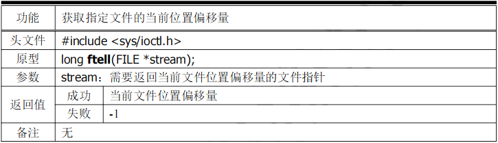
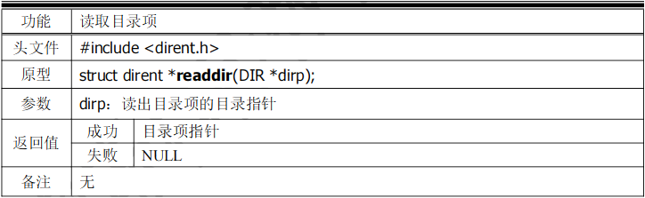
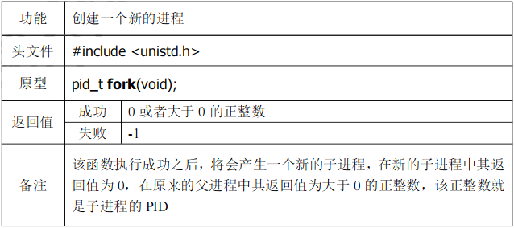
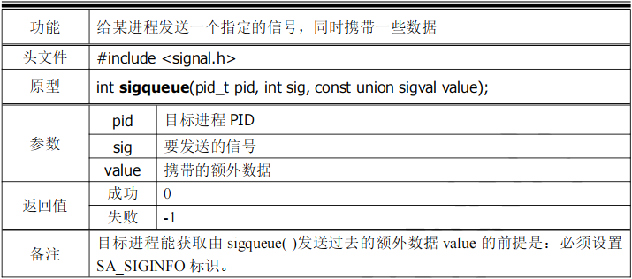
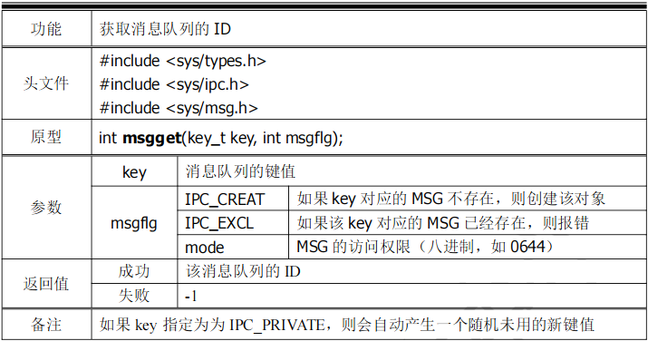
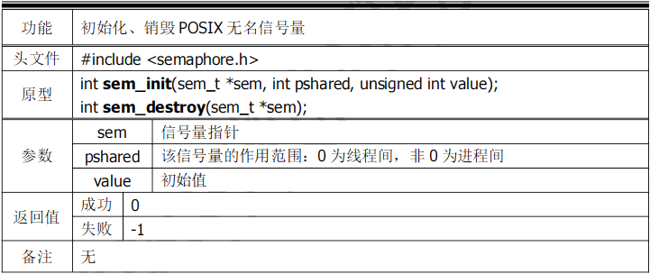
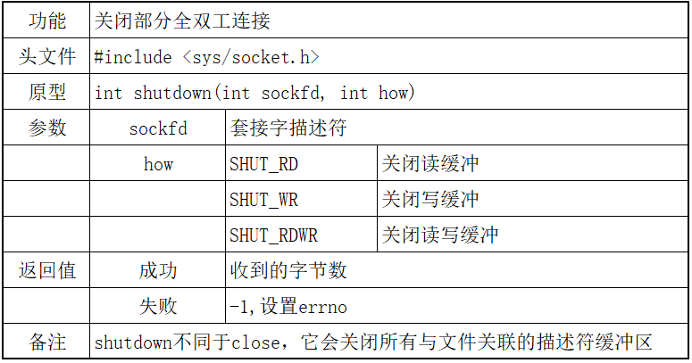

# **函数速查集**
- [**函数速查集**](#函数速查集)
- [1. C数据结构](#1-c数据结构)
- [2. C系统编程](#2-c系统编程)
    - [2.1. 系统IO](#21-系统io)
    - [2.2. 标准IO](#22-标准io)
    - [2.3. 文件控制](#23-文件控制)
    - [2.4. 目录IO](#24-目录io)
    - [2.5. 进程](#25-进程)
    - [2.6. IPC进程通讯](#26-ipc进程通讯)
        - [2.6.1. 管道](#261-管道)
            - [2.6.2. 信号](#262-信号)
        - [2.6.3. 消息队列](#263-消息队列)
        - [2.6.4. 共享内存](#264-共享内存)
        - [2.6.5. 信号量](#265-信号量)
    - [2.7. 线程](#27-线程)
- [3. C网络编程](#3-c网络编程)

# 1. C数据结构
| <a href="#top">[返回目录]</a> | 跳转  |    功能描述    | 代码示例                                                    |
| :---------------------------- | :---: | :------------: | ----------------------------------------------------------- |
| -                             | 单链表  | 单链表的操作 | [单链表](../Code/02_DateStruct/list.c) |
| -                             |   链队   |       链式队列操作        | [链队](..Code/../../Code/02_DateStruct/link_queue.c)                                                           |
| -                             |   d   |       d        | -                                                           |
| -                             |   d   |       d        | -                                                           |

# 2. C系统编程

## 2.1. 系统IO
| <a href="#top">[返回目录]</a> |          函数详解          |     功能描述     | 代码示例 |
| :---------------------------- | :------------------------: | :--------------: | :------: |
| man 2 open                    |  <a href="#open">open</a>  |     打开文件     |    -     |
| man 2 close                   | <a href="#close">close</a> |     关闭文件     |    -     |
| man 2 read                    |  <a href="#read">read</a>  |   读取文件内容   |    -     |
| man 2 write                   | <a href="#write">write</a> |   写入文件内容   |    -     |
| man 2 lseek                   | <a href="#lseek">lseek</a> |     光标偏移     |    -     |
| man 2 dup                     |   <a href="#dup">dup</a>   | 复制的文件描述符 |    -     |

## 2.2. 标准IO
| <a href="#top">[返回目录]</a> |              函数详解              |               功能描述               |                          代码示例                           |
| :---------------------------- | :--------------------------------: | :----------------------------------: | :---------------------------------------------------------: |
| man 3 fopen                   |     <a href="#fopen">fopen</a>     |        打开文件(获取文件指针)        | [文件拷贝](../Code/03_SystemPrograming/01_stdIo/fileCopy.c) |
| man 3 fclose                  |    <a href="#fclose">fclose</a>    |               关闭文件               |                              -                              |
| man 3 xxx                     |  <a href="#getc_set">getc_set</a>  |     getc.getchar.fgetc(获取字符)     |                              -                              |
| man 3 xxx                     |  <a href="#putc_set">putc_set</a>  |     putc.putchar.fputc(输出字符)     |                              -                              |
| man 3 xxx                     |  <a href="#feof">feof&ferror</a>   |  feof.ferror(文件尾和文件出错检测)   |                              -                              |
| man 3 xxx                     | <a href="#gets_set">gets函数集</a> |        gets.fgets(获取字符串)        |                              -                              |
| man 3 xxx                     | <a href="#puts_set">puts函数集</a> |        puts.fputs(输入字符串)        |                              -                              |
| man 3 fread                   |     <a href="#fread">fread</a>     |               二进制读               |                              -                              |
| man 3 fwrite                  |    <a href="#fwrite">fwrite</a>    |               二进制写               |                              -                              |
| man 3 fseek                   |     <a href="#fseek">fseek</a>     |             设置光标位置             |                              -                              |
| man 3 ftell                   |     <a href="#ftell">ftell</a>     |        获取当前文件光标偏移量        |                              -                              |
| man 3 rewind                  |    <a href="#rewind">rewind</a>    |          偏移量设置为开头处          |                              -                              |
| man 3 fscanf                  |    <a href="#fscanf">fscanf</a>    | 从指定的文件或者内存中读取格式化数据 |                              -                              |
| man 3 fprintf                 |   <a href="#fprintf">fprintf</a>   |  将格式化数据写入指定的文件或者内存  |                              -                              |

## 2.3. 文件控制
| <a href="#top">[返回目录]</a> |             函数详解             |          功能描述           |                                     代码示例                                     |
| :---------------------------- | :------------------------------: | :-------------------------: | :------------------------------------------------------------------------------: |
| man 2 ioctl                   |    <a href="#ioctl">ioctl</a>    | 工具箱(内容杂乱,不建议使用) |                                        -                                         |
| man 2 fcntl                   |    <a href="#fcntl">fcntl</a>    | 文件控制工具集(ioctl改良版) |   [获取/设置属性,实现dup](../Code/03_SystemPrograming/03_file_option/fcntl.c)    |
| man 2 stat                    |     <a href="#stat">stat</a>     |        获取文件状态         | [获取文件信息，判断文件类型](../Code/03_SystemPrograming/03_file_option/stat.c)  |
| man 2 truncate                | <a href="#truncate">truncate</a> |  将一个文件截断为指定长度   |                                        -                                         |
| man 2 access                  |   <a href="#access">access</a>   |      获取文件访问权限       |                                        [文件重命名](../Code/03_SystemPrograming/03_file_option/rename.c)                                         |
| man 2 chmod                   |    <a href="#chmod">chmod</a>    |        修改文件权限         |                                        -                                         |
| man 3 xxx                     |    <a href="#fd_fp">fd&fp</a>    |        fd转fp/fp转fd        | [文件描述符和文件指针的关系](../Code/03_SystemPrograming/03_file_option/fd_fp.c) |

<a id="dirIo">目录IO</a>
## 2.4. 目录IO
| <a href="#top">[返回目录]</a> | 函数详解                         | 功能                 |                                                                      代码示例                                                                      |
| ----------------------------- | -------------------------------- | -------------------- | :------------------------------------------------------------------------------------------------------------------------------------------------: |
| man 3 opendir                 | <a href="#opendir">opendir</a>   | 打开目录             |                                                                         _                                                                          |
| man 3 closedir                | <a href="#closedir">closedir</a> | 关闭目录             |                                                                         _                                                                          |
| man 3 readdir                 | <a href="#readdir">readdir</a>   | 读取目录             | [自定义ls命令](../Code/03_SystemPrograming/02_dirIo/customized_ls.c) [自定义ls -R命令](../Code/03_SystemPrograming/02_dirIo/customized_ls_-R.c) |
| man 2 getcwd                  | <a href="#getcwd">getcwd</a>     | 获取当前工作目录     |                                                                         _                                                                          |
| man 2 chdir                   | <a href="#chdir">chdir</a>       | 修改当前进程工作目录 |                                                                         _                                                                          |

## 2.5. 进程
| <a href="#top">[返回目录]</a> |            函数详解            |                         功能描述                         |                                    代码示例                                    |
| :---------------------------- | :----------------------------: | :------------------------------------------------------: | :----------------------------------------------------------------------------: |
| man 2 fork                    |    <a href="#fork">fork</a>    |                        创建子进程                        |         [进程扇](../Code/03_SystemPrograming/05_process/process_fan.c)         |
| man 3 xxx                     | <a href="#exec">exec函数簇</a> | 在进程中加载新的程序文件或者脚本，覆盖原有代码，重新运行 |                                       -                                        |
| man 2 exit                    |    <a href="#exit">exit</a>    |                         退出进程                         | [逆序打印多个进程号](../Code/03_SystemPrograming/05_process/process_reverse.c) |
| man 2 wait                    |    <a href="#wait">wait</a>    |                      等待子进程退出                      |                                       -                                        |

## 2.6. IPC进程通讯

### 2.6.1. 管道
| <a href="#top">[返回目录]</a> |           函数详解           |   功能描述   |                                                                     代码示例                                                                     |
| :---------------------------- | :--------------------------: | :----------: | :----------------------------------------------------------------------------------------------------------------------------------------------: |
| man 2 pipe                    |   <a href="#pipe">pipe</a>   | 创建无名管道 | [亲子进程管道通讯](../Code/03_SystemPrograming/06_ipc/1_pipe/pipe.c) [兄弟进程管道通讯](../Code/03_SystemPrograming/06_ipc/1_pipe/pipe_bro.c) |
| man 3 mkfifo                  | <a href="#mkfifo">mkfifo</a> | 创建有名管道 |     [有名管道读端](../Code/03_SystemPrograming/06_ipc/1_pipe/fifo_r.c) [有名管道写端](../Code/03_SystemPrograming/06_ipc/1_pipe/fifo_w.c)     |

####  2.6.2. 信号

| <a href="#top">[返回目录]</a> |                 函数详解                  |                              功能描述                              |                                                                                   代码示例                                                                                   |
| :---------------------------- | :---------------------------------------: | :----------------------------------------------------------------: | :--------------------------------------------------------------------------------------------------------------------------------------------------------------------------: |
| kill -l                       |     <a href="#kill_list">信号列表</a>     |                           信号列表及概览                           |                                                                                      -                                                                                       |
| man 2 kill                    |         <a href="#kill">kill</a>          |                           向进程发送信号                           |                                                                                      -                                                                                       |
| man 2 signal                  |       <a href="#signal">signal</a>        |                              响应信号                              |                                                                                      -                                                                                       |
| man 3 raise                   |        <a href="#raise">raise</a>         |                         给进程自己发送信号                         |                                                                                      -                                                                                       |
| man 2 pasue                   |        <a href="#pause">pause</a>         |                   将本进程挂起，直到收到一个信号                   |                                                                                      -                                                                                       |
| man 2 alarm                   |        <a href="#alarm">alarm</a>         |          给进程设置闹钟，到时间后会给进程发送SIGALRM信号           |                                                                                      -                                                                                       |
| man 2 setitimer               | <a href="#itimer">setitimer/getitimer</a> |                      获取或设置间隔计时器的值                      |                                                                                      -                                                                                       |
| man 3 xxx                     |       <a href="#sig_set">信号集</a>       |                             信号集操作                             |                                                                                      -                                                                                       |
| man 2 sigprocmask             |  <a href="#sigprocmask">sigprocmask</a>   |                  阻塞或者解除阻塞一个或者多个信号                  |                                               [未决信号集和信号阻塞集](../Code/03system_programing/06_ipc/2_signal/sig_set.c)                                                |
| man 2 sigpending              |   <a href="#sigpending">sigpending</a>    |                        获取未决信号集的信息                        |                                                                                      -                                                                                       |
| man 3 sigqueue                |     <a href="#sigqueue">sigqueue</a>      |            给某进程发送一个指定的信号，同时携带一些数据            |                                               [发送信号并携带信号数据](../Code/03system_programing/06_ipc/2_signal/sigqueue.c)                                               |
| man 2 sigaction               |    <a href="#sigaction">sigaction</a>     | 捕捉一个指定的信号，且可以通过扩展响应函数来获取信号携带的额外数据 | [设置信号响应函数](../Code/03system_programing/06_ipc/2_signal/sigaction.c) [借助信号捕捉回收子进程](../Code/03system_programing/06_ipc/2_signal/sigaction_catch_child.c) |
| man 2 getsid                  |       <a href="#getsid">getsid</a>        |                             获取会话ID                             |                                              [子进程当会长,脱离控制终端](../Code/03system_programing/06_ipc/2_signal/printId.c)                                              |
| man 2 setsid                  |       <a href="#setsid">setsid</a>        |                       创建会话并设置进程组ID                       |                                                     [创建精灵进程](../Code/03system_programing/06_ipc/2_signal/daemon.c)                                                     |
| man 2 getpgid/setpgid         |  <a href="#getpgid">getpgid/setpgid</a>   |                         获取/设置进程组ID                          |                                                                                      -                                                                                       |

### 2.6.3. 消息队列
| <a href="#top">[返回目录]</a> |              函数详解               |            功能描述            | 代码示例                                                                                                                                     |
| :---------------------------- | :---------------------------------: | :----------------------------: | -------------------------------------------------------------------------------------------------------------------------------------------- |
| man 3 ftok                    |      <a href="#ftok">ftok</a>       |   获取一个当前未用的IPC的key   | -                                                                                                                                            |
| man 2 msgget                  |     <a ref="#msgget">msgget</a>     |        获取消息队列的ID        | -                                                                                                                                            |
| man 2 msgsnd/msgrcv           | <a href="#msgsnd">msgsnd/msgrcv</a> |         发送、接收消息         | [[消息队列写端]](../Code/03_SystemPrograming/06_ipc/4_msgq/msgsnd.c) [[消息队列读端]](../Code/03_SystemPrograming/06_ipc/4_msgq/msgrcv.c) |
| man 2 msgctl                  |    <a href="#msgctl">msgctl</a>     | 设置或者获取消息队列的相关属性 | -                                                                                                                                            |

### 2.6.4. 共享内存
| <a href="#top">[返回目录]</a> |           函数详解           |             功能描述             | 代码示例                                                                                                                                   |
| :---------------------------- | :--------------------------: | :------------------------------: | ------------------------------------------------------------------------------------------------------------------------------------------ |
| man 3 ftok                    |   <a href="#ftok">ftok</a>   |    获取一个当前未用的IPC的key    | -                                                                                                                                          |
| man 2 shmget                  | <a href="#shmget">shmget</a> |         获取共享内存的ID         | [[共享内存写端]](../Code/03_SystemPrograming/06_ipc/3_shm/shmsnd.c) [[共享内存读端]](../Code/03_SystemPrograming/06_ipc/3_shm/shmrcv.c) |
| man 2 shmat                   |  <a href="#shmat">shmat</a>  | 对共享内存进行映射，或者解除映射 | -                                                                                                                                          |
| man 2 shmctl                  | <a href="#shmctl">shmctl</a> |  获取或者设置共享内存的相关属性  | -                                                                                                                                          |

### 2.6.5. 信号量
| <a href="#top">[返回目录]</a> |              函数详解              |             功能描述              | 代码示例                                                                                                                                               |
| :---------------------------- | :--------------------------------: | :-------------------------------: | :----------------------------------------------------------------------------------------------------------------------------------------------------- |
| **系统V信号量**               |     <a id="ipc_sem_SysV">-</a>     |                 -                 | -                                                                                                                                                      |
| man 2 semget                  |    <a href="#semget">semget</a>    |          获取信号量的ID           | -                                                                                                                                                      |
| man 2 semop                   |     <a href="#semop">semop</a>     | 对信号量进行P/V操作，或者等零操作 | [[系统V信号量写端]](../Code/03_SystemPrograming/06_ipc/5_semph/semsnd.c) [[系统V信号量读端]](../Code/03_SystemPrograming/06_ipc/5_semph/semrcv.c)   |
| man 2 semctl                  |    <a href="#semctl">semctl</a>    |   获取或者设置信号量的相关属性    | -                                                                                                                                                      |
| **有名信号量**                |    <a id="ipc_sem_named">-</a>     |                 -                 | -                                                                                                                                                      |
| man 2 sem_open                |  <a href="#sem_open">sem_open</a>  |   创建、打开一个POSIX有名信号量   | -                                                                                                                                                      |
| man 2 sem_wait/sem_post       |  <a href="#sem_wait">sem_wait</a>  |   对POSIX有名信号量进行P、V操作   | [[有名信号量写端]](../Code/03_SystemPrograming/06_ipc/5_semph/p_semsnd.c) [[有名信号量读端]](../Code/03_SystemPrograming/06_ipc/5_semph/p_semrcv.c) |
| man 2 sem_close               | <a href="#sem_close">sem_close</a> |     关闭、删除POSIX有名信号量     | -                                                                                                                                                      |
| **无名信号量**                |    <a id="ipc_sem_annoy">-</a>     |                 -                 | -                                                                                                                                                      |
| man 2 sem_init                |  <a href="#sem_init">sem_init</a>  |    初始化、销毁POSIX无名信号量    | [[匿名信号量demo]](../Code/03_SystemPrograming/06_ipc/5_semph/sem_anonymous.c)                                                                         |
| man 2 sem_wait/sem_post       |  <a href="#sem_wait">sem_wait</a>  |   对POSIX无名信号量进行P、V操作   | -                                                                                                                                                      |

## 2.7. 线程

| <a href="#top">[返回目录]</a>      |                              函数详解                              |                   功能描述                   |                                       代码示例                                        |
| :--------------------------------- | :----------------------------------------------------------------: | :------------------------------------------: | :-----------------------------------------------------------------------------------: |
| man 3 phtread_create               |            <a href="#phtread_create">pthread_create</a>            |                创建一条新线程                |                                           -                                           |
| man 3 phread_attr_setdetachstate   |       <a href="#phread_attr_setdetachstate">设置分离属性</a>       |           获取、设置线程的分离属性           |     [[分离线程demo]](../Code/03_SystemPrograming/07_thread/pthread_detach_test.c)     |
| man 3 pthread_attr_setinheritsched | <a href="#pthread_attr_setinheritsched">设置调度策略的继承属性</a> |    获取、设置线程是否继承创建者的调度策略    |                                           -                                           |
| man 3 pthread_attr_setschedpolicy  |      <a href="#pthread_attr_setschedpolicy">设置调度策略</a>       |           获取、设置线程的调度策略           |                                           -                                           |
| man 3 pthread_attr_setschedparam   |      <a href="#pthread_attr_setschedparam">线程调度优先级</a>      |     获取、设置线程静态优先级/动态优先级      |                                           -                                           |
| man 3 pthread_attr_setstacksize    |      <a href="#pthread_attr_setstacksize">栈和警戒区大小</a>       |       获取、设置线程栈大小、警戒区大小       |                                           -                                           |
| man 3 pthread_exit                 |              <a href="#pthread_exit">pthread_exit</a>              |                   退出线程                   |                                           -                                           |
| man 3 pthread_join                 |              <a href="#pthread_join">pthread_join</a>              |                 接合指定线程                 |                                           -                                           |
| man 3 pthread_cancel               |            <a href="#pthread_cancel">pthread_cancel</a>            |                   取消线程                   |          [取消线程](../Code/03_SystemPrograming/07_thread/pthread_cancel.c)           |
| man 3 pthread_setcancelstate       |    <a href="#pthread_setcancelstate">pthread_setcancelstate</a>    |      获取、设置线程的取消状态和取消类型      |                                           -                                           |
| man 3 pthread_cleanup_push         |        <a href="#pthread_cleanup_push">取消例程的栈操作</a>        |        压栈、或弹栈线程的取消处理例程        | [防止线程在执行任务时被终止](../Code/03_SystemPrograming/07_thread/pthread_cleanup.c) |
| man 3 pthread_cond_init            |      <a href="#pthread_cond_init">条件变量的初始化和销毁</a>       |             初始化、销毁条件变量             |      [[条件变量demo]](../Code/03_SystemPrograming/07_thread/pthread_condition.c)      |
| man 3 phtread_cond_wait            |         <a href="#phtread_cond_wait">phtread_cond_wait</a>         | 进入条件变量等待队列，同时对获取配套的互斥锁 |                                           -                                           |
| man 3 pthread_cond_broadcast       |   <a href="#pthread_cond_broadcast">唤醒被条件变量阻塞的线程</a>   |  唤醒全部，或者一个条件变量等待队列中的线程  |                                           -                                           |
| man 3 pthread_mutex_lock           |                       pthread_mutex_lock</a>                       |                  定义互斥锁                  |      [[互斥锁demo]](../Code/03_SystemPrograming/07_thread/pthread_mutex_lock.c)       |
| man 3 pthread_rwlock_rlock         |                      pthread_rwlock_rlock</a>                      |                 定义互读写锁                 |       [[读写斥锁demo]](../Code/03_SystemPrograming/07_thread/pthread_rwlock.c)        |
| man d                              |                         <a href="#d">d</a>                         |                      d                       |                                           -                                           |
| man d                              |                         <a href="#d">d</a>                         |                      d                       |                                           -                                           |
| man d                              |                         <a href="#d">d</a>                         |                      d                       |                                           -                                           |

# 3. C网络编程
| <a href="#top">[返回目录]</a> |                      函数详解                      |                  功能描述                   |                                             代码示例                                              |
| :---------------------------- | :------------------------------------------------: | :-----------------------------------------: | :-----------------------------------------------------------------------------------------------: |
| man 3 inet_pton               |         <a href="#inet_pton">inet_pton</a>         |           点分式ip转网络字节序ip            |                                                 -                                                 |
| man inet_pton                 |         <a href="#inet_pton">inet_pton</a>         |           网络字节序ip转点分式ip            |                                                 -                                                 |
| man 7 ip                      | <a href="#struct_sockaddr">struct_sockaddr ***</a> |               地址信息结构体                |                                                 -                                                 |
| man 2 socket                  |            <a href="#socket">socket</a>            |                创建通讯端点                 |                                                 -                                                 |
| man 2 bind                    |              <a href="#bind">bind</a>              |    在套接字上绑定IP、端口号、协议簇信息     |                                                 -                                                 |
| man 2 listen                  |            <a href="#listen">listen</a>            |                设置监听上限                 |                                                 -                                                 |
| man 2 accept                  |            <a href="#accept">accept</a>            |       建立与用户的连接，接收其套接字        |                       [tcp接收端(server)](../Code/04_network/tcp/server.c)                        |
| man 2 connect                 |           <a href="#connect">connect</a>           |             在套接字上启动连接              |                       [tcp发送端(client)](../Code/04_network/tcp/client.c)                        |
| man 2 sendto                  |            <a href="#sendto">sendto</a>            |   向某网络主机地址发送信息(常用于udp协议)   |  [udp发送端](../Code/04_network/udp/snd.c) [接收组播](../Code/04_network/udp/rcv_multicast.c)  |
| man 2 recvfrom                |              <a href="#">recvfrom</a>              | 接收来自某网络主机地址的信息(常用于udp协议) |  [udp接收端](../Code/04_network/udp/rcv.c) [发送组播](../Code/04_network/udp/snd_multicast.c)  |
| man 3 setsocketopt            |      <a href="#setsocketopt">setsocketopt</a>      |               设置套接字选项                | [端口复用](../Code/04_network/tcp/server.c) [发送广播](../Code/04_network/udp/snd_broadcast.c) |
| man 2 shutdown                |          <a href="#shutdown">shutdown</a>          |             关闭部分全双工连接              |                                                 -                                                 |
| man 2 select                  |            <a href="#select">select</a>            |     监视文件描述符集的读、写、异常事件      |                                                 -                                                 |
| man 2 FD_ZERO                 |     <a href="#select_opt">select监听集操作</a>     |         操作select文件描述符集的宏          |                                                 -                                                 |
| man d                         |                 <a href="#d">d</a>                 |                      d                      |                                                 -                                                 |
| man d                         |                 <a href="#d">d</a>                 |                      d                      |                                                 -                                                 |

| <a href="#systemIo">open</a> |
| :--------------------------: |
|         |

| <a href="#systemIo">close</a> |
| :---------------------------: |
|         |

| <a href="#systemIo">read</a> |
| :--------------------------: |
|         |

| <a href="#systemIo">write</a> |
| :---------------------------: |
|         |

| <a href="#systemIo">lseek</a> |
| :---------------------------: |
|         |

| <a href="#systemIo">dup</a> |
| :-------------------------: |
|         |

| <a href="#systemIo">ioctl</a> |
| :---------------------------: |
|         |

|                <a href="#fileControl">fcntl</a>                |
| :------------------------------------------------------------: |
| [代码示例](../Code/03system_programing/03_file_option/fcntl.c) |
|                                          |
|                                      |

| <a href="#standardIo">fopen</a> |
| :-----------------------------: |
|           |

| <a href="#standardIo">fclose</a> |
| :------------------------------: |
|           |

| <a href="#standardIo">getc函数集</a> |
| :----------------------------------: |
|             |

| <a href="#standardIo">putc函数集</a> |
| :----------------------------------: |
|             |

| <a href="#standardIo">feof&ferror</a> |
| :-----------------------------------: |
|          |

| <a href="#standardIo">gets函数集</a> |
| :----------------------------------: |
|             |

| <a href="#standardIo">puts函数集</a> |
| :----------------------------------: |
|             |

| <a href="#standardIo">fread</a> |
| :-----------------------------: |
|           |

| <a href="#standardIo">fwrite</a> |
| :------------------------------: |
|           |

| <a href="#standardIo">fseek</a> |
| :-----------------------------: |
|           |

| <a href="#standardIo">ftell</a> |
| :-----------------------------: |
|           |

| <a href="#standardIo">rewind</a> |
| :------------------------------: |
|           |

| <a href="#standardIo">fscanf</a> |
| :------------------------------: |
|           |

| <a href="#standardIo">fprintf</a> |
| :-------------------------------: |
|           |
|      |

| <a href="#fileControl">stat</a> |
| :-----------------------------: |
|            |
|     |
|      |

| <a href="#dirIo">opendir</a> |
| :--------------------------: |
|      |

| <a href="#dirIo">closedir</a> |
| :---------------------------: |
|      |

|  <a href="#dirIo">readdir</a>  |
| :----------------------------: |
|        |
|  |

| <a href="#dirIo">getcwd</a> |
| :-------------------------: |
|      |

| <a href="#dirIo">chdir</a> |
| :------------------------: |
|      |

| <a href="#fileControl">truncate</a> |
| :---------------------------------: |
|            |

| <a href="#fileControl">access</a> |
| :-------------------------------: |
|            |

| <a href="#fileControl">chmod</a> |
| :------------------------------: |
|            |

| <a href="#fileControl">fd和fp的关系</a> |
| :-------------------------------------: |

| <a href="#process">fork</a> |
| :-------------------------: |
|        |

| <a href="#process">exec函数簇</a> |
| :-------------------------------: |
|              |

| <a href="#process">exit</a> |
| :-------------------------: |
|        |

| <a href="#process">wait</a>  |
| :--------------------------: |
|         |
|  |

| <a href="#ipc_pipe">pipe</a> |
| :--------------------------: |
|         |

| <a href="#ipc_pipe">mkfifo</a> |
| :----------------------------: |
|         |
|        |

| <a href="#ipc_signal">信号列表</a> |
| :--------------------------------: |
|        |

| <a href="#ipc_signal">kill</a> |
| :----------------------------: |
|           |

| <a href="#ipc_signal">signal</a> |
| :------------------------------: |
|           |

| <a href="#ipc_signal">raise</a> |
| :-----------------------------: |
|           |

| <a href="#ipc_signal">pause</a> |
| :-----------------------------: |
|           |

| <a href="#ipc_signal">信号集</a> |
| :------------------------------: |
|          |

| <a href="#ipc_signal">sigprocmask</a> |
| :-----------------------------------: |
|           |

| <a href="#ipc_signal">sigqueue</a> |
| :--------------------------------: |
|           |
|       |

| <a href="#ipc_signal">sigaction</a> |
| :---------------------------------: |
|           |
|    |

| <a href="#ipc_signal">alarm</a> |
| :-----------------------------: |
|           |

| <a href="#ipc_signal">setitimer/getitimer</a> |
| :-------------------------------------------: |
|                        |

| <a href="#ipc_signal">sigpending</a> |
| :----------------------------------: |
|           |

| <a href="#ipc_signal">getsid</a> |
| :------------------------------: |
|           |

| <a href="#ipc_signal">setsid</a> |
| :------------------------------: |
|           |

| <a href="#ipc_signal">getpgid</a> |
| :-------------------------------: |
|           |

| <a href="#ipc_msg">ftok</a> |
| :-------------------------: |
|        |

| <a href="#ipc_msg">msgget</a> |
| :---------------------------: |
|        |

| <a href="#ipc_msg">msgsnd</a> |
| :---------------------------: |
|        |

| <a href="#ipc_msg">msgctl</a> |
| :---------------------------: |
|        |
|  |

| <a href="#ipc_shm">shmget</a> |
| :---------------------------: |
|        |

| <a href="#ipc_shm">shmat</a> |
| :--------------------------: |
|        |

| <a href="#ipc_shm">shmctl</a> |
| :---------------------------: |
|        |

| <a href="#ipc_sem_SysV">semget</a> |
| :--------------------------------: |
|             |

| <a href="#ipc_sem_SysV">semop</a> |
| :-------------------------------: |
|             |

| <a href="#ipc_sem_SysV">semctl</a> |
| :--------------------------------: |
|             |

| <a href="#thread">phtread_create</a> |
| :----------------------------------: |
|        |

| <a href="#thread">phread_attr_setdetachstate</a> |
| :----------------------------------------------: |
|      |

| <a href="#thread">pthread_attr_setinheritsched</a> |
| :------------------------------------------------: |
|       |

| <a href="#thread">pthread_attr_setschedpolicy</a> |
| :-----------------------------------------------: |
|       |

| <a href="#thread">pthread_attr_setschedparam</a> |
| :----------------------------------------------: |
|       |

| <a href="#thread">pthread_attr_setstacksize</a> |
| :---------------------------------------------: |
|       |

| <a href="#thread">pthread_exit</a> |
| :--------------------------------: |
|       |

| <a href="#thread">pthread_join</a> |
| :--------------------------------: |
|       |

| <a href="#thread">pthread_cancel</a> |
| :----------------------------------: |
|       |

| <a href="#thread">pthread_setcancelstate</a> |
| :------------------------------------------: |
|       |

| <a href="#thread">pthread_cleanup</a> |
| :-----------------------------------: |
|  |

| <a href="#ipc_sem_named">sem_open</a> |
| :-----------------------------------: |
|              |

| <a href="#ipc_sem_named">sem_wait</a> |
| :-----------------------------------: |
|              |

| <a href="#sem_close">sem_close</a> |
| :--------------------------------: |
|          |

| <a href="#ipc_sem_annoy">sem_init</a> |
| :-----------------------------------: |
|              |

| <a href="#thread">pthread_cond_init</a> |
| :-------------------------------------: |
|       |

| <a href="#thread">phtread_cond_wait</a> |
| :-------------------------------------: |
|       |

| <a href="#thread">pthread_cond_broadcast</a> |
| :------------------------------------------: |
|       |

| <a href="#network">inet_pton</a> |
| :------------------------------: |
|        |

| <a href="#network">inet_ntop</a> |
| :------------------------------: |
|        |

| <a href="#network">struct_sockaddr</a> |
| :------------------------------------: |
|        |
|       |

| <a href="#network">socket</a> |
| :---------------------------: |
|        |

| <a href="#network">bind</a> |
| :-------------------------: |
|        |

| <a href="#network">listen</a> |
| :---------------------------: |
|        |

| <a href="#network">accept</a> |
| :---------------------------: |
|        |

| <a href="#network">connect</a> |
| :----------------------------: |
|        |

| <a href="#network">sendto</a> |
| :---------------------------: |
|        |

| <a href="#network">recvfrom</a> |
| :-----------------------------: |
|        |

| <a href="#network">setsocketopt</a> |
| :---------------------------------: |
|        |

| <a href="#network">shutdown</a> |
| :-----------------------------: |
|        |

 
 | <a href="#network">select</a> |
 | :---------------------------: |
 |        |

 
 | <a href="#network">操作select集合的宏</a> |
 | :---------------------------------------: |
 |                |